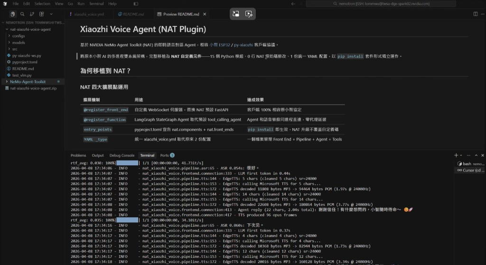

# Xiaozhi Voice Agent (NAT Plugin)

[English](README_en.md) | **繁體中文**

基於 NVIDIA NeMo Agent Toolkit (NAT) 的即時語音對話 Agent，相容 [小智 ESP32](https://github.com/78/xiaozhi-esp32) / [py-xiaozhi](https://github.com/zhayujie/py-xiaozhi) 客戶端協議。

將原本小智 AI 的多進程雙系統架構，完整移植為 **NAT 自定義元件**——15 個 Python 模組、0 行 NAT 原始碼修改、1 份統一 YAML 配置，以 `pip install` 套件形式獨立運作。

### Demo

[](https://youtu.be/F58cTtn1T2I)

## 為何移植到 NAT？

### NAT 四大擴展點運用

| 擴展機制 | 用途 | 達成效果 |
|---------|------|---------|
| `@register_front_end` | 自定義 WebSocket 伺服器，替換 NAT 預設 FastAPI | 客戶端 100% 相容原小智協定 |
| `@register_function` | LangGraph StateGraph Agent 取代預設 tool_calling_agent | Agent 和語音管線同進程直連，零代理延遲 |
| `entry_points` | pyproject.toml 宣告 nat.components + nat.front_ends | `pip install` 即生效，NAT 升級不覆蓋自定義碼 |
| `YAML _type` | 統一 xiaozhi_voice.yml 取代原來 2 份配置 | 一個檔案管理 Front End + Pipeline + Agent + Tools |

### 移植優勢

| 優勢 | 說明 |
|------|------|
| 延遲降低 | 移除 HTTP 代理層，Agent 呼叫改為同進程函數呼叫，每輪減少 50-100ms |
| 維運簡化 | 服務進程從 5 減至 3，配置檔從 2 份整合為 1 份 YAML |
| 觀測增強 | Phoenix 可追蹤完整鏈路 VAD → ASR → LLM → Tool → TTS，不再有黑箱 |
| 擴展彈性 | NAT 新版工具（Code Exec、RAG 等）直接可用，`pip install --upgrade nvidia-nat` 不影響自定義碼 |
| 記憶統一 | 對話記憶由 NAT Workflow 原生管理，支援 per-device-id 持久記憶 |
| 回退安全 | `pip uninstall nat-xiaozhi-voice-agent` 即完全回退，可與原系統並行測試 |

### 成果

| 指標 | 數值 |
|------|------|
| Python 模組 | 15 個 |
| NAT 擴展點 | 4 個（front_end + function + entry_points + YAML _type） |
| 修改 NAT 原始碼 | **0 行** |
| 配置檔 | 1 份統一 YAML |
| 語音管線參數一致性 | 7 項關鍵參數 100% 與原系統一致 |
| 客戶端修改 | **零修改**——ESP32 / py-xiaozhi 直接遷移 |

## 架構

```
客戶端 (ESP32 / py-xiaozhi)
    │  WebSocket (Opus audio + JSON control)
    ▼
┌─────────────────────────────────────┐
│  Xiaozhi Voice Agent (NAT Plugin)   │
│                                     │
│  ┌─────┐  ┌─────┐  ┌────────────┐  │
│  │ VAD │→ │ ASR │→ │ LLM Agent  │  │
│  │Silero│  │Fun  │  │ (LangGraph)│  │
│  │     │  │ASR  │  │  + Tools   │  │
│  └─────┘  └─────┘  └─────┬──────┘  │
│                           │         │
│                     ┌─────▼──────┐  │
│                     │    TTS     │  │
│                     │ (Edge TTS) │  │
│                     └────────────┘  │
└─────────────────────────────────────┘
```

**語音管線：**
- **VAD** — Silero VAD (ONNX)，偵測語音活動
- **ASR** — FunASR SenseVoiceSmall，支援中/英/日/粵語
- **LLM** — 透過 NVIDIA NIM API 呼叫（可替換任意 OpenAI-compatible 模型）
- **TTS** — Microsoft Edge TTS（免費雲端）或 CosyVoice（本地）

**特性：**
- 基於 LangGraph 的 ReAct Agent，支援 Tool Calling
- 每裝置獨立對話記憶（SQLite 持久化）
- 歷史壓縮：超過閾值時自動摘要舊對話
- 串流 TTS：LLM 邊生成邊合成語音，降低首音延遲

## 前置需求

### 系統

- Linux (x86_64 或 aarch64，已在 DGX Spark aarch64 上驗證)
- Python 3.11 / 3.12 / 3.13
- [NVIDIA API Key](https://build.nvidia.com/)（用於 LLM / VLM 推論）

### 系統套件（Docker 方式免裝）

```bash
sudo apt-get install -y libopus-dev libopus0 libsndfile1-dev
```

### 模型檔案（Docker 方式自動下載）

原生安裝需要下載兩個模型到 `models/` 目錄：

```bash
# 1. Silero VAD
cd models/
git clone https://github.com/snakers4/silero-vad.git snakers4_silero-vad

# 2. FunASR SenseVoiceSmall
pip install huggingface_hub
python3 -c "
from huggingface_hub import snapshot_download
snapshot_download('FunAudioLLM/SenseVoiceSmall', local_dir='models/SenseVoiceSmall')
"
```

## 安裝

有三種安裝方式。**Docker** 最快，一行啟動；**方式 A** 適合原生安裝；**方式 B** 適合開發者。

---

### Docker（最快）

需要 Docker + [NVIDIA Container Toolkit](https://docs.nvidia.com/datacenter/cloud-native/container-toolkit/install-guide.html)。

```bash
git clone https://github.com/tommywu052/nat-xiaozhi-voice-agent.git
cd nat-xiaozhi-voice-agent

# 建立 .env 檔案設定 API Key
echo 'NVIDIA_API_KEY=nvapi-YOUR_KEY' > .env
echo 'TAVILY_API_KEY=tvly-YOUR_KEY' >> .env   # 選配

# 建置並啟動（首次會自動下載模型，約 5-10 分鐘）
docker compose up -d --build
```

啟動後 WebSocket 端點：`ws://localhost:8000/xiaozhi/v1/`

```bash
# 查看日誌
docker compose logs -f

# 停止
docker compose down
```

> Docker image 已包含 CUDA runtime、PyTorch、ASR/VAD 模型，**不需要額外安裝任何依賴**。

**啟用 USB 攝影機（explain_scene 工具）：**

容器預設無法存取 host 的 USB 攝影機。如需使用 `explain_scene` 工具，編輯 `docker-compose.yml` 取消註解 `devices` 區段：

```yaml
    devices:
      - /dev/video0:/dev/video0
```

確認攝影機裝置路徑：

```bash
ls /dev/video*
# 通常 /dev/video0 為第一顆 USB 攝影機
```

> 如果 host 沒有接攝影機，不需要設定。`explain_scene` 被呼叫時會回傳友善的錯誤訊息，不影響其他功能。

---

### 方式 A — pip install（原生安裝）

NAT 已發佈至 PyPI（套件名 `nvidia-nat`），不需要 clone NAT repo。

```bash
git clone https://github.com/tommywu052/nat-xiaozhi-voice-agent.git
cd nat-xiaozhi-voice-agent

python3 -m venv .venv
source .venv/bin/activate

pip install -e .
```

> `pip install -e .` 會自動安裝 `nvidia-nat[langchain]` 及所有依賴（LangChain、LangGraph、Tavily 等）。

---

### 方式 B — 從 NAT 原始碼安裝

適合需要開發 / 除錯 NAT 核心，或想使用 git main 最新功能的情況。

```bash
git clone -b main https://github.com/NVIDIA/NeMo-Agent-Toolkit.git
cd NeMo-Agent-Toolkit
git submodule update --init --recursive

# 安裝 uv（如尚未安裝）
curl -LsSf https://astral.sh/uv/install.sh | sh
source $HOME/.local/bin/env

# 建立虛擬環境
uv venv --python 3.12 --seed .venv
source .venv/bin/activate

# 安裝 NAT 核心 + langchain 插件
uv sync
uv pip install -e ".[langchain]"

# 安裝 Voice Agent Plugin
uv pip install -e /path/to/nat-xiaozhi-voice-agent
```

---

### PyTorch 版本修正（兩種方式皆需執行）

`funasr` 依賴會拉入 PyTorch，但可能安裝到不匹配的版本。
**安裝完成後**，執行以下命令覆蓋為正確版本：

**有 NVIDIA GPU + CUDA（DGX Spark / Jetson 等）— 推薦：**

```bash
pip install torch==2.11.0+cu128 torchaudio==2.11.0+cu128 \
    --index-url https://download.pytorch.org/whl/cu128 --reinstall
```

> ASR 在 GPU 上比 CPU 快 ~8 倍（59ms vs 460ms，5 秒音訊）。
> DGX Spark 的 NVIDIA GB10 有 120GB 顯存，SenseVoiceSmall 僅佔用幾百 MB。

**無 GPU 或 CUDA 環境：**

```bash
pip install torch torchaudio --index-url https://download.pytorch.org/whl/cpu
```

### 設定 NAT 時區（推薦）

NAT 的 `current_datetime` 工具預設回傳 UTC 時間。如果你的系統時區已正確設定（如 `Asia/Taipei`），
執行以下命令讓工具回傳本地時間：

```bash
mkdir -p ~/.config/nat
echo '{"fallback_timezone": "system"}' > ~/.config/nat/config.json
```

驗證系統時區：

```bash
timedatectl | grep "Time zone"
# 預期輸出：Time zone: Asia/Taipei (CST, +0800)
```

### 設定 config

編輯 `configs/xiaozhi_voice.yml`：

```yaml
# 必須修改的項目：
llms:
  main_llm:
    api_key: "nvapi-YOUR_NVIDIA_API_KEY"    # 替換為你的 NVIDIA API Key

general:
  front_end:
    vad_model_dir: "/absolute/path/to/models/snakers4_silero-vad"
    asr_model_dir: "/absolute/path/to/models/SenseVoiceSmall"

# 選配：啟用 web_search（Tavily）
functions:
  web_search:
    api_key: "tvly-YOUR_TAVILY_KEY"   # 或透過環境變數 TAVILY_API_KEY 設定
```

## 啟動

```bash
source .venv/bin/activate
export NVIDIA_API_KEY="nvapi-YOUR_KEY"

nat start xiaozhi_voice \
    --config_file /path/to/nat-xiaozhi-voice-agent/configs/xiaozhi_voice.yml
```

啟動成功後會看到：

```
Voice pipeline ready (VAD + ASR + TTS)
Uvicorn running on http://0.0.0.0:8000 (Press CTRL+C to quit)
LLM warm-up done in 0.77s
```

## 客戶端連接

WebSocket 端點：`ws://<SERVER_IP>:8000/xiaozhi/v1/`

支援的客戶端：
- **py-xiaozhi-ws.py**（本專案內建測試客戶端，見下方說明）
- [py-xiaozhi](https://github.com/zhayujie/py-xiaozhi)（Python 桌面客戶端）
- [xiaozhi-esp32](https://github.com/78/xiaozhi-esp32)（ESP32 硬體裝置）
- 任何相容小智 WebSocket 協議的客戶端

### 內建測試客戶端 — py-xiaozhi-ws.py

專案附帶 `py-xiaozhi-ws.py`，可在桌面環境中快速測試語音對話。按住空白鍵說話，放開送出，ESC 退出。

**額外依賴安裝：**

```bash
pip install pyaudio pynput pyserial
```

> `pyaudio` 需要系統安裝 PortAudio：`sudo apt-get install -y portaudio19-dev`

**環境變數：**

| 變數 | 預設值 | 說明 |
|------|--------|------|
| `XIAOZHI_DEVICE_ID` | *(無預設，必須設定)* | 裝置 ID，用於識別客戶端並綁定對話記憶 |
| `XIAOZHI_WS_URL` | `ws://localhost:8000/xiaozhi/v1/` | Voice Agent WebSocket 端點 |
| `XIAOZHI_CLIENT_ID` | `py-xiaozhi-ws-client` | 客戶端識別名稱 |
| `EYE_SERIAL_PORT` | `COM10` | ESP32 眼球模組 Serial port（無硬體可忽略） |

**啟動方式：**

```bash
# 最簡用法（使用預設值）
python py-xiaozhi-ws.py

# 自訂裝置 ID 與伺服器位址
XIAOZHI_DEVICE_ID="your-device-id" \
XIAOZHI_WS_URL="ws://192.168.1.100:8000/xiaozhi/v1/" \
python py-xiaozhi-ws.py
```

**操作方式：**

| 按鍵 | 功能 |
|------|------|
| 按住空白鍵 | 開始錄音 |
| 放開空白鍵 | 停止錄音並送出 |
| 數字鍵 0-9 | 手動切換 ESP32 眼球設計 |
| h / a / s / u / c / n | 情緒快捷鍵（happy / angry / sad / surprised / confused / neutral） |
| ESC | 退出程式 |

**功能特色：**
- 透過 Opus 編碼即時傳送 / 接收音訊
- 支援 ESP32 眼球表情模組（Serial 連接，無硬體時自動略過）
- 自動處理 TTS 播放中的打斷（按空白鍵 abort）

## API 端點

| 方法 | 路徑 | 說明 |
|------|------|------|
| GET | `/health` | 健康檢查（回傳管線狀態） |
| GET | `/api/memory` | 列出所有有對話記憶的裝置 |
| DELETE | `/api/memory/{device_id}` | 清除指定裝置的對話記憶 |
| DELETE | `/api/memory` | 清除所有裝置的對話記憶 |

## 內建工具

所有工具預設皆已註冊，**啟動時不會報錯**。只有在 LLM 實際呼叫時才會觸發對應資源，若資源不可用會返回友善的錯誤訊息而非 crash。

| 工具 | 執行時需求 | 說明 |
|------|-----------|------|
| `current_datetime` | 無 | 查詢目前日期時間（使用系統時區） |
| `wiki_search` | 無 | 維基百科搜尋 |
| `web_search` | Tavily API Key | 即時網路搜尋（新聞、天氣等）；無 Key 時回傳錯誤訊息 |
| `explain_scene` | USB 攝影機 | 透過 VLM 描述攝影機畫面；無攝影機時回傳「無法開啟攝影機」 |

### explain_scene 工具設定

`explain_scene` 透過 `llm_name` 引用 YAML 中定義的 LLM，共用 NVIDIA NIM endpoint 和 API Key，
只需另外指定多模態視覺模型：

```yaml
functions:
  explain_scene:
    _type: explain_scene
    camera_index: 0
    llm_name: main_llm                      # 共用 main_llm 的 base_url 和 api_key
    vlm_model: "google/gemma-4-31b-it"      # 多模態視覺模型
```

也支援獨立設定（不引用 LLM）：

```yaml
functions:
  explain_scene:
    _type: explain_scene
    camera_index: 0
    vlm_base_url: "https://integrate.api.nvidia.com/v1"
    vlm_api_key: "nvapi-YOUR_KEY"
    vlm_model: "google/gemma-4-31b-it"
```

**NVIDIA NIM 可用的視覺模型：**

| 模型 | 中文支援 | 辨識精度 | 回應速度（熱啟動） |
|------|---------|---------|----------------|
| `google/gemma-4-31b-it` | 優秀（繁體中文） | 高（正確辨識 RTX 5090） | ~2.5s |
| `meta/llama-3.2-11b-vision-instruct` | 差（常用英文回覆） | 中（誤判型號） | ~8s |
| `meta/llama-3.2-90b-vision-instruct` | 中 | 高 | ~15s |
| `microsoft/phi-4-multimodal-instruct` | 中 | 中 | 待測 |

> **推薦：** `google/gemma-4-31b-it`，中文能力最好、辨識最精準。首次呼叫有 ~35s 冷啟動，後續穩定 2-3 秒。

## LLM 模型建議

| 模型 | 純對話 TTFT | 帶工具 TTFT | Tool Calling 判斷 | 中文回覆品質 | 適合場景 |
|------|-----------|-----------|-----------------|------------|---------|
| `qwen/qwen3-next-80b-a3b-instruct` | ~0.44s | ~1.5s | 優秀（85% <2s） | 優秀 | **推薦** — 工具判斷準確、語意理解強 |
| `meta/llama-3.1-8b-instruct` | ~0.17s | ~1.0s | 一般（常誤判） | 一般 | 低延遲純對話 |
| `meta/llama-3.3-70b-instruct` | ~0.6s | ~12s | 完整支援 | 良好 | 複雜任務、工具密集 |
| `nvidia/llama-3.1-nemotron-nano-8b-v1` | ~1.8s | 不支援 | 不支援 | 一般 | 純對話（不建議） |

> **推薦：** 語音 Agent 首選 `qwen/qwen3-next-80b-a3b-instruct`，在工具呼叫判斷（何時該/不該用工具）和語意理解上遠優於 8B 模型。

## 效能參考（DGX Spark aarch64 + qwen3-next-80b）

| 階段 | 延遲 |
|------|------|
| VAD + ASR (SenseVoiceSmall) | ~0.4s |
| LLM 純對話 TTFT | ~0.4s |
| LLM + 輕量工具 TTFT | ~1.5s |
| EdgeTTS 合成 | ~0.5-1.0s |
| VLM explain_scene（熱啟動） | ~2.5s |
| **端到端（純對話）** | **~1.0-1.5s** |

## 目錄結構

```
nat-xiaozhi-voice-agent/
├── configs/
│   └── xiaozhi_voice.yml          # NAT 統一配置檔
├── models/                         # 模型檔案（需自行下載）
│   ├── snakers4_silero-vad/        # Silero VAD ONNX 模型
│   └── SenseVoiceSmall/            # FunASR 語音辨識模型
├── src/nat_xiaozhi_voice/
│   ├── frontend/                   # NAT 前端插件（WebSocket 伺服器）
│   │   ├── config.py               # Pydantic 配置定義
│   │   ├── connection.py           # 單一連線處理（VAD→ASR→LLM→TTS）
│   │   ├── plugin.py               # NAT FrontEndBase 實作
│   │   ├── register.py             # NAT 前端註冊
│   │   └── ws_server.py            # FastAPI WebSocket 伺服器
│   ├── pipeline/                   # 語音管線元件
│   │   ├── asr.py                  # FunASR 語音辨識
│   │   ├── tts.py                  # Edge TTS / CosyVoice 語音合成
│   │   └── vad.py                  # Silero VAD 語音活動偵測
│   ├── tools/                      # 自定義 NAT 工具
│   │   ├── register.py             # explain_scene 工具註冊（支援 llm_name 引用）
│   │   └── vlm_camera.py           # VLM 攝影機工具
│   ├── utils/
│   │   ├── audio_codec.py          # Opus 編解碼
│   │   ├── audio_rate_controller.py # 音訊速率控制
│   │   └── auth.py                 # JWT 認證
│   └── workflow/
│       └── register.py             # LangGraph Agent 定義（含記憶壓縮）
├── py-xiaozhi-ws.py                # 桌面測試客戶端（空白鍵對講）
├── test_vlm.py                     # VLM 視覺模型測試腳本
├── Dockerfile                      # Docker 容器定義
├── docker-compose.yml              # 一鍵啟動配置
├── pyproject.toml
└── README.md
```

## 疑難排解

**Q: `ModuleNotFoundError: No module named 'torch'` 或 `libc10_cuda.so: cannot open shared object`**
A: PyTorch 安裝了 CUDA 版本但系統無 CUDA 驅動。強制安裝 CPU 版：
```bash
pip install torch torchaudio --index-url https://download.pytorch.org/whl/cpu
```

**Q: `Input tag 'wiki_search' does not match any of the expected tags`**
A: NAT langchain 插件未安裝。方式 A 使用者重新執行 `pip install -e .`；方式 B 使用者執行：
```bash
cd NeMo-Agent-Toolkit
uv pip install -e ".[langchain]"
```

**Q: `LLM 'main_llm' not found`（explain_scene 啟動失敗）**
A: explain_scene 使用 `llm_name` 引用 LLM 時，需確保 YAML 的 `llms` 區段有對應定義。

**Q: `Cannot open USB webcam (index=0)`**
A: 無 USB 攝影機時 `explain_scene` 不會 crash，只會在被呼叫時回傳「無法開啟攝影機」的友善訊息。

**Q: `current_datetime` 回傳 UTC 時間而非本地時間**
A: 設定 NAT 時區為系統時區：
```bash
mkdir -p ~/.config/nat
echo '{"fallback_timezone": "system"}' > ~/.config/nat/config.json
```

**Q: `Error code: 400 - max_completion_tokens`**
A: 部分 NVIDIA NIM 模型不支援 `max_tokens` 參數，從 config 的 LLM 區段中移除即可。

**Q: Port 8000 already in use**
A: 先清除佔用的 process：
```bash
lsof -ti:8000 | xargs -r kill -9
```

**Q: LLM 回應很慢（>10s）**
A: 可能原因：
1. 模型太大（如 122B），換成 `qwen/qwen3-next-80b-a3b-instruct`
2. 工具回傳資料量太大，減少 `doc_content_chars_max`
3. 模型重複呼叫同一工具，考慮在 system prompt 中加強限制

**Q: 重建 .venv 後 plugin 消失**
A: 方式 A：重新 `pip install -e .` 即可。方式 B：`uv sync` 會重置虛擬環境，需重新安裝：
```bash
uv pip install -e ".[langchain]"
uv pip install -e /path/to/nat-xiaozhi-voice-agent
```
兩種方式都需要重新執行 PyTorch 版本修正步驟。
